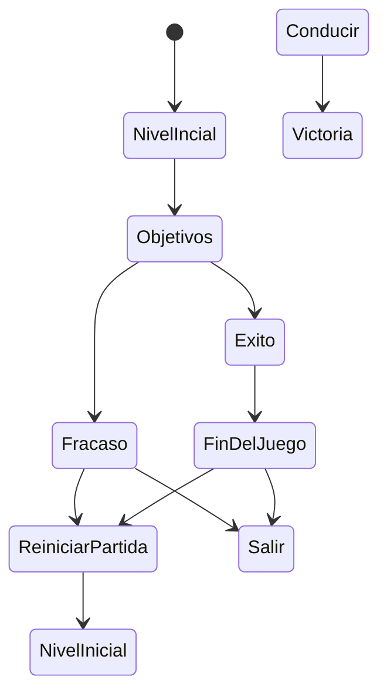
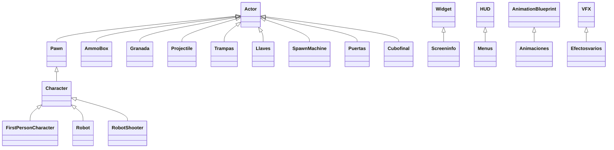

# DEV22-G05-P4

Se trata de un prototipo básico de un shooter en primera persona en el que controlamos a un personaje con un arma y granadas que debe superar un nivel con varios enemigos sencillos y dos mecánicas para superar diferentes pruebas. El jugador deberá conseguir dos llaves para abrir dos puertas, eliminar cierto número de enemigos y destruir todas las máquinas "spawn" para activar el final del juego.

##Instalación y uso:
Tras descargar el repositorio, sustituir la carpeta FirstPersonBP del proyecto base por la que ha sido descargada de GitHub. Se han añadido también las carpetas Infinity Blade: Effects (https://unrealengine.com/marketplace/en-US/product/infinity-blade-effects) y M5 VFX Vol2 (https://www.unrealengine.com/marketplace/en-US/product/m5-vfx-vol2-fire-and-flames)

##Preproducción
La práctica consiste en mejorar el prototipo ejecutable de un videojuego shooter en primera persona esta en forma de aventura con varias mecánicas de nivel y comportamiento de los enemigos, mediante el uso de efectos visuales y mejoras de comportamiento. 

El videojuego consiste en superar ciertas pruebas, explicadas a continuación para completar todas las tareas y acabar el nivel.

El diseño tiene estas secciones:
- [Estética](#Estética)
  * [Gráficos](#Gráficos)
  * [Sonidos](#Sonidos)
- [Dinámica](#Dinámica)
  * [Objetivo](#Objetivo)
  * [Castigo](#Derrota)
- [Mecánica](#Mecánica)
  * [Avatar](#Avatar)
  * [Robot](#Robot)
  * [RobotShooter](#RobotShooter)
  * [Granadas](#Granadas)
  * [Caja de munición](#AmmoBox)
  * [Trampas](#Trampas)
  * [Puertas cerradas](#Puertas)
  * [Llaves](#Llaves)
  * [Máquinas de spawn](#SpawnMachines)
  * [HUD](#HUD)
- [Animaciones](#Animaciones)
- [Producción](#Produccion)

##Estética:
El juego usa texturas y materiales básicos de la carpeta StarterContent. Se han añadido efectos y sonidos adicionales, además de animaciones para los enemigos.

##Sonidos:
No hay música ambiente, y los sonidos usados han sido:
- **Disparos del fusil**. Se activa al disparar el fusil.
- **Coger AmmoBox**. Sonará tras coger la caja de munición.
- **Coger granada**. Sonará tras coger la granada.
- **Explosión de granada**. Sonará tras lanzar la granada y esperar a que explote.

##Dinámica:
La dinámica de este juego consiste en destruir cierto número de robots y plataformas de "spawn" para ir activando ciertas llaves y el cubo que finaliza el nivel en sí. Mediante munición limitada, granadas y trampas deberemos llevar a cabo tales tareas. Inicialmente el jugador aparecerá con una cantidad de munición y una granada, puediendo conseguir más con los bonus repartidos por el mapa. Deberá conseguir dos llaves en la primera sala: la primera se encuentra en lo alto de una rampa, y la segunda se activará cuando cierto número de robots sean destruidos. En la segunda sala habrá más enemigos y plataformas "spawn" para destruir. Cuando todas las plataformas sean eliminadas, el cubo del final de juego aparecerá.

#### Objetivo
El objetivo del juego será superar las dos salas con enemigos sin morir en el intento. Habrá que cumplir ciertas tareas para ello:
- Eliminar 4 enemigos en la primera sala.
- Conseguir las dos llaves para abrir las dos puertas bloqueadas.
- Eliminar todas las plataformas "spawn" repartidas por el mapa.
- Coger el cubo final y acabar el nivel.

#### Castigo
Como castigo podremos morir si no tenemos cuidado con la cantidad de robots que no ataquen, haciendo que aparezca un menú donde se nos permita reiniciar la misión o salir de la partida.

##Mecánica
Eliminar robots sin que nos maten, mientras completamos los objetivos de la pantalla.

####Avatar
El personaje proporcionado por defecto por Unreal Engine para juegos en primera persona.

####Robot
El robot será el enemigo del personaje. Tendrá una inteligencia basada en los árboles de comportamiento. Cada robot patrullará de forma interrumpida hasta que vea al jugador. Cuando esto ocurra, comenzará a perseguirle y al acercarse mucho, podrá dañarle físicamente. Reaparecerán constantemente hasta que se destruyan las plataformas que los generan. Una nueva mecánica también implementada junto con las animaciones, han sido efectos que aparecen cuando el robot recibe cierta cantidad de daño. La animación cambiará, mostrando movimientos erráticos, y chispas que saldrán del cuerpo del enemigo. Si el jugador lo elimina, hará aparecer una llamarada en el suelo que afectará a cualquier Character que esté encima durante unos segundos.

####RobotShooter
El robot Shooter es una mejora del apartado anterior. Este enemigo se moverá por un sistema AI Perception, que será estimulado por su correspondiente AI Stimuli Source dentro del jugador. Seguirá un árbol de comportamiento similar al del Robot estándar, pero en vez de aproximarse al jugador, le disparará cuando le haya visto. También, este enemigo podrá perder de vista al jugador, siguiendo con la patrulla hasta volver a verle.

#### Granadas
Objeto que tras ser lanzado con la letra "G" tardará 3 segundos en explotar, eliminando cualquier actor que se encuentre en el rango de acción. El daño infligido será de 1000. El jugador comenzará con una granada, pudiendo conseguir una segunda tras comenzar el juego. 

####AmmoBox
Caja de munición que repondrás las 50 balas que puede llevar el jugador. El bonus estará repartido en varias localizaciones del mapa.

####Trampas
En la primera sala existirán dos trampas colgadas de un cable. Si reciben un disparo, se activarán, cayendo al suelo y eliminando cualquier actor que tengan debajo.

####Puertas
Entre la primera y segunda sala hay dos puertas bloqueadas que solo podrán ser abiertas cuando el jugador consiga las llaves de la primera sala. La primera en lo alto de una rampa, y la segunda tras eliminar 4 robots.

####Llaves
Objetos para abrir las puertas que separan las dos salas.

####SpawnMachines
Máquinas que serán capaces de hacer aparecer en el mapa a un robot. Si ese robot es eliminado, instantáneamente la máquina generará uno nuevo. Esto podrá repetirse de forma infinita. Las plataformas podrán ser destruidas igualmente por el jugador. En esta versión se ha añadido un efecto visual y sonido cada vez que hacen reaparecer algún enemigo.

####HUD
En la pantalla podrán aparecer varios menús y un HUD básico para el jugador. Los menús serán de victoria y derrota, pudiendo en el primero reiniciar el nivel con mayor dificultad (enemigos con más salud) y en el segundo reiniciarlo simplemente. En ambos se podrá salir de la partida.
El HUD básico contendrá un indicador de la salud del jugador, la cantidad de munición que lleva y las granadas, además de los objetivos para completar la misión.

##Produccion
## Producción

Las tareas se han realizado y el esfuerzo ha sido repartido entre los autores.

| Estado  |  Tarea  |  Fecha  |  
|:-:|:--|:-:|
| ✔ | Diseño: Primer borrador | 5-5-2023 |
| ✔ | Mecánica: Robots con arma| 5-5-2023 |
| ✔ | Mecánica: Disparos y hitbox | 6-5-2023 |
| ✔ | Mecánica: Árbol de comportamiento | 10-4-2023 |
| ✔ | Mecánica: Menús, sonidos y efectos | 11-5-2023 |
| ✔ | Mecánica: Detalles y bugs | 15-5-2023 |

Las clases principales que se han desarrollados son las siguientes.

